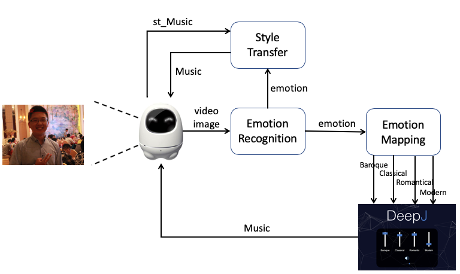
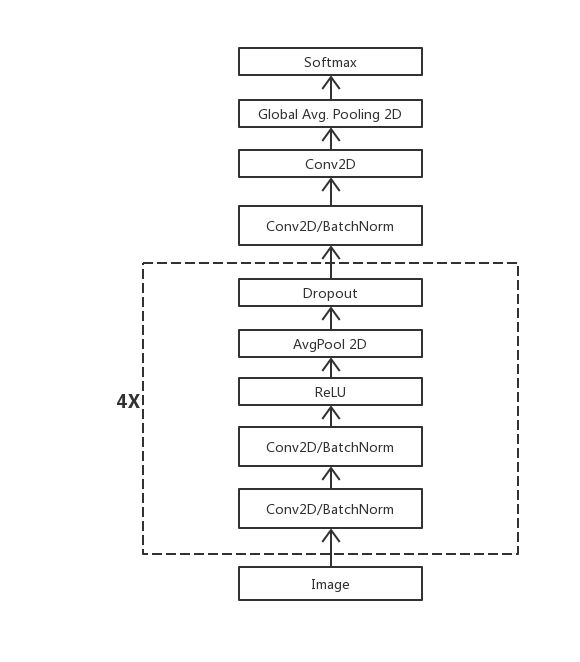

# 心音
  面部表情可以很好的反映出人的心情，而音乐又与心情息息相关，当人处于烦躁时，一首舒缓的音乐不仅可以放松心情，也可以给人带来美的享受。

## 功能设计说明
摄像头捕捉人脸，分析出人的实时情绪(生气、厌恶、害怕、高兴、悲伤、惊讶、平和)，通过情绪的种类映射出参数(巴洛克风格、古典风格、浪漫风格、现代风格)，通过这个参数利用DeepJ进行音乐生成，之后还会通过继续捕捉人脸，识别情绪，对音乐的曲风进行实时的迁移。整个过程中还有语音交互进行控制。

## 功能结构图

## 关键技术分析
实时情绪分析：通过视频捕获人脸，采用CNN网络对人脸进行情绪分析。进行同样的4次卷积、归一化处理，之后进行全局池化，softmax输出概率。 
 
音乐生成：深度学习网络，通过4个风格参数生成一首纯音乐。 
曲风迁移：深度学习网络，通过输入音乐以及曲风，生成对应曲风的音乐。 
语音交互：IBM Speech2Text，Text2Speech。 

## 项目结果演示

[PPT中有完整的介绍](./心音.pptx)  
同时可以观看我们录制的视频:
[音由心生](./音由心生.mov)
[心音](./心音.mp4)

##展望
1、智能机器人作为平台，收集用户数据，为内容提供商提供数据，根据数据可以为用户提供定制化服务；
2、内容提供商可以自行开发应用搭载到智能机器人平台(音乐系统就是其中之一)。

更多详细信息请移至我们的[作品展示页面](https://www.hackx.org/projects/366)